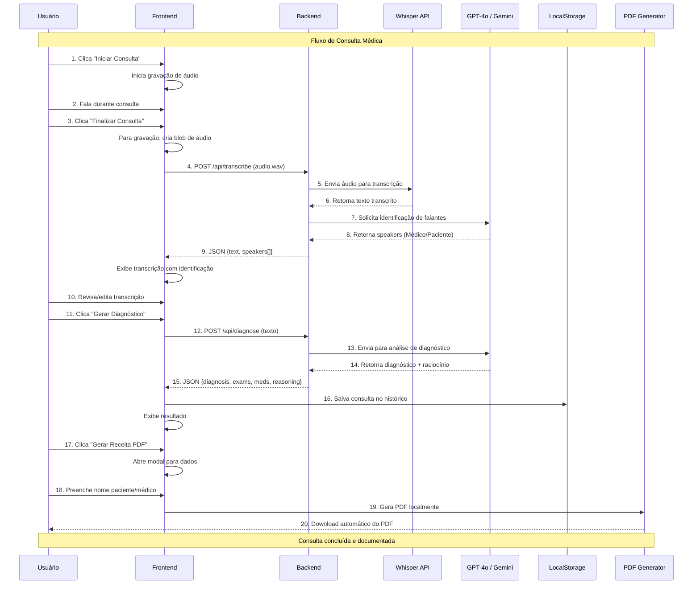

# 🩺 MedCopilot - Assistente de Diagnóstico Médico com IA

<div align="center">


**Sistema inteligente de transcrição de consultas médicas e geração automática de diagnósticos utilizando IA**

[Funcionalidades](#-funcionalidades) •
[Arquitetura](#-arquitetura) •
[Instalação](#-instalação) •
[Uso](#-uso) •
[Tecnologias](#-tecnologias)

</div>

---

## 📋 Índice

- [Sobre o Projeto](#-sobre-o-projeto)
- [Funcionalidades](#-funcionalidades)
- [Arquitetura](#-arquitetura)
- [Fluxo de Dados](#-fluxo-de-dados)
- [Tecnologias](#-tecnologias)
- [Pré-requisitos](#-pré-requisitos)
- [Instalação](#-instalação)
- [Configuração](#-configuração)
- [Uso](#-uso)
- [Estrutura do Projeto](#-estrutura-do-projeto)
- [API Endpoints](#-api-endpoints)
- [Recursos Avançados](#-recursos-avançados)
- [Demonstração](#-demonstração)
- [Roadmap](#-roadmap)
- [Contribuindo](#-contribuindo)
- [Licença](#-licença)

---

## 🎯 Sobre o Projeto

**MedCopilot** é uma aplicação web fullstack que utiliza inteligência artificial para auxiliar profissionais de saúde no processo de consultas médicas. O sistema oferece:

- 🎙️ **Transcrição em tempo real** de áudio para texto usando OpenAI Whisper
- 🧠 **Identificação de falantes** (Médico/Paciente) com diarização inteligente
- 🔍 **Diagnóstico automático** gerado por GPT-4o-mini ou Gemini 2.0
- 📊 **Explicabilidade da IA** mostrando o raciocínio do diagnóstico
- 🌐 **Interface multilíngue** (Português/Inglês)
- 💾 **Histórico de consultas** armazenado localmente
- 📄 **Geração de receitas médicas** em PDF

> ⚠️ **Aviso Legal**: Este projeto é educacional e não substitui avaliação médica profissional. Não deve ser usado para diagnósticos reais.

---

## ✨ Funcionalidades

### 🎤 Transcrição de Áudio
- Gravação de áudio diretamente pelo navegador
- Transcrição automática usando OpenAI Whisper
- Edição manual da transcrição
- Identificação automática de falantes (Médico/Paciente)

### 🧠 Diagnóstico Inteligente
- Análise de transcrição com GPT-4o-mini ou Gemini 2.0 Flash
- Geração de:
  - Diagnóstico provável
  - Doenças associadas
  - Exames sugeridos
  - Medicamentos comuns
  - **Raciocínio da IA** (explicação do diagnóstico)

### 📊 Histórico e Gerenciamento
- Armazenamento local de até 50 consultas
- Visualização e busca de consultas anteriores
- Restauração de consultas para revisão
- Exclusão de registros

### 🌍 Multilíngue
- Suporte completo para Português (PT-BR)
- Suporte completo para Inglês (EN)
- Alternância dinâmica de idioma
- Persistência da preferência

### 📄 Geração de Receitas
- PDF profissional com layout médico
- Campos personalizáveis (nome do paciente/médico)
- Inclusão automática de diagnóstico, medicamentos e exames
- Download instantâneo

---

## 🏗️ Arquitetura

```mermaid
graph TB
    subgraph "Frontend - React + TypeScript"
        UI[Interface do Usuário]
        Audio[MediaRecorder API]
        State[Gerenciamento de Estado]
        I18n[Sistema de Tradução]
        Storage[LocalStorage]
        PDF[Geração de PDF]
    end

    subgraph "Backend - Fastify + TypeScript"
        API[API REST]
        Routes[Rotas]
        Controllers[Controllers]
        Services[Services]
        Schemas[Validação Zod]
    end

    subgraph "Inteligência Artificial"
        Whisper[OpenAI Whisper<br/>Transcrição]
        GPT[GPT-4o-mini<br/>Diagnóstico + Diarização]
        Gemini[Gemini 2.0 Flash<br/>Alternativa]
    end

    UI -->|Grava áudio| Audio
    Audio -->|FormData| API
    API --> Routes
    Routes --> Controllers
    Controllers --> Services
    Services -->|Transcreve| Whisper
    Whisper -->|Texto| Services
    Services -->|Identifica falantes| GPT
    GPT -->|Speakers| Services
    Services -->|JSON| Controllers
    Controllers -->|Response| UI
    
    UI -->|Texto| API
    Services -->|Analisa| GPT
    Services -->|Alternativa| Gemini
    GPT -->|Diagnóstico| Services
    Gemini -->|Diagnóstico| Services
    
    UI -->|Salva consulta| Storage
    Storage -->|Histórico| UI
    UI -->|Gera PDF| PDF
    PDF -->|Download| UI
    
    State -->|Controla| UI
    I18n -->|Traduz| UI

    style Whisper fill:#10a37f
    style GPT fill:#10a37f
    style Gemini fill:#4285f4
    style UI fill:#61dafb
    style API fill:#000000
    style PDF fill:#e74c3c
```



---

## 🔄 Fluxo de Dados



---

## 🛠️ Tecnologias

### Frontend
- **React 19.2.0** - Biblioteca UI
- **TypeScript 5.9.3** - Superset JavaScript tipado
- **Vite 7.2.2** - Build tool e dev server
- **Tailwind CSS 4.1.17** - Framework CSS utilitário
- **Axios 1.13.2** - Cliente HTTP
- **jsPDF 2.5.2** - Geração de PDFs
- **Lucide React** - Ícones
- **React Router 7.9.6** - Roteamento

### Backend
- **Fastify 5.6.2** - Framework web rápido
- **TypeScript 5.9.3** - Tipagem estática
- **Zod 4.1.12** - Validação de schemas
- **@fastify/cors** - CORS middleware
- **@fastify/multipart** - Upload de arquivos
- **OpenAI SDK 6.9.0** - API OpenAI
- **Google Generative AI 0.24.1** - API Gemini
- **dotenv 17.2.3** - Variáveis de ambiente

### IA e Machine Learning
- **OpenAI Whisper** - Transcrição de áudio
- **GPT-4o-mini** - Análise e diagnóstico
- **Gemini 2.0 Flash** - Alternativa ao GPT

---

## 📦 Pré-requisitos

- **Node.js** >= 18.0.0
- **npm** ou **yarn**
- **Chave API OpenAI** (obter em https://platform.openai.com/api-keys)
- **Chave API Google Gemini** (obter em https://ai.google.dev/) - opcional

---

## 🚀 Instalação

### 1. Clone o repositório

```bash
git clone https://github.com/carlosresendeP/medico-copilot.git
cd medico-copilot
```

### 2. Instale as dependências

#### Backend
```bash
cd backend
npm install
```

#### Frontend
```bash
cd ../interface
npm install
```

---

## ⚙️ Configuração

### Backend - Variáveis de Ambiente

Crie um arquivo `.env` na pasta `backend/`:

```env
# OpenAI Configuration (Obrigatório)
OPENAI_API_KEY=sk-proj-your-api-key-here

# Google Gemini Configuration (Opcional)
GEMINI_API_KEY=your-gemini-api-key-here

# AI Provider (openai ou gemini)
AI_PROVIDER=openai

# Server Configuration
PORT=3333
NODE_ENV=development
```

### Obter Chaves de API

#### OpenAI
1. Acesse https://platform.openai.com/api-keys
2. Faça login ou crie uma conta
3. Clique em "Create new secret key"
4. Copie a chave e adicione ao `.env`

#### Google Gemini (Opcional)
1. Acesse https://ai.google.dev/
2. Clique em "Get API Key"
3. Crie um projeto no Google AI Studio
4. Copie a chave e adicione ao `.env`

---

## 🎮 Uso

### 1. Inicie o Backend

```bash
cd backend
npm run dev
```

O servidor estará rodando em `http://localhost:3333`

### 2. Inicie o Frontend

Em outro terminal:

```bash
cd interface
npm run dev
```

A aplicação estará disponível em `http://localhost:5173`

### 3. Utilize a aplicação

1. **Iniciar Consulta**
   - Clique no botão "Iniciar Consulta"
   - Permita o acesso ao microfone
   - Fale naturalmente durante a consulta

2. **Finalizar e Transcrever**
   - Clique em "Finalizar Consulta"
   - Aguarde a transcrição automática
   - Revise e edite se necessário

3. **Gerar Diagnóstico**
   - Clique em "Gerar Diagnóstico"
   - Aguarde a análise da IA
   - Visualize diagnóstico, exames e medicamentos

4. **Gerar Receita PDF**
   - Clique em "Gerar Receita PDF"
   - Preencha dados opcionais
   - Baixe o documento

5. **Acessar Histórico**
   - Clique no botão "Histórico"
   - Visualize consultas anteriores
   - Abra ou exclua registros

6. **Alternar Idioma**
   - Clique no botão de idioma (PT/EN)
   - A interface será traduzida instantaneamente

---

## 📁 Estrutura do Projeto

```
medico-copilot/
├── backend/
│   ├── src/
│   │   ├── config/
│   │   │   ├── ai.config.ts          # Configuração OpenAI/Gemini
│   │   │   └── env.ts                # Variáveis de ambiente
│   │   ├── controllers/
│   │   │   ├── diagnose.controller.ts
│   │   │   └── transcribe.controller.ts
│   │   ├── routes/
│   │   │   └── index.ts              # Definição de rotas
│   │   ├── schemas/
│   │   │   ├── diagnose.schema.ts    # Validação Zod
│   │   │   └── transcribe.schema.ts
│   │   ├── services/
│   │   │   ├── diagnose.service.ts   # Lógica de diagnóstico
│   │   │   └── transcribe.service.ts # Lógica de transcrição
│   │   ├── types/
│   │   │   ├── diagnostic.ts
│   │   │   └── transcribe.ts
│   │   ├── app.ts                    # Configuração Fastify
│   │   └── server.ts                 # Entrada da aplicação
│   ├── package.json
│   └── tsconfig.json
│
├── interface/
│   ├── src/
│   │   ├── components/
│   │   │   ├── ActionButton.tsx      # Botões principais
│   │   │   ├── DiagnosisResult.tsx   # Exibição de diagnóstico
│   │   │   ├── HistoryPanel.tsx      # Painel de histórico
│   │   │   ├── LanguageSwitcher.tsx  # Seletor de idioma
│   │   │   ├── Layout.tsx            # Layout principal
│   │   │   ├── PrescriptionModal.tsx # Modal de receita
│   │   │   ├── SpeakerTranscription.tsx # Transcrição com falantes
│   │   │   ├── StatusBar.tsx         # Barra de status
│   │   │   └── TranscriptionView.tsx # Visualização de transcrição
│   │   ├── contexts/
│   │   │   └── LanguageContext.tsx   # Context API i18n
│   │   ├── hooks/
│   │   │   └── useMedCopilot.ts      # Hook principal
│   │   ├── Pages/
│   │   │   └── Home.tsx              # Página principal
│   │   ├── services/
│   │   │   ├── api.ts                # Cliente Axios
│   │   │   ├── consultation.service.ts # CRUD histórico
│   │   │   ├── diagnose.service.ts   # Chamadas API diagnóstico
│   │   │   ├── prescription.service.ts # Geração PDF
│   │   │   └── transcribe.service.ts # Chamadas API transcrição
│   │   ├── types/
│   │   │   └── consultation.ts       # Tipos TypeScript
│   │   ├── utils/
│   │   │   └── audioUtils.ts         # Utilitários de áudio
│   │   ├── App.tsx
│   │   ├── main.tsx
│   │   └── types.ts
│   ├── package.json
│   └── vite.config.ts
│
├── PRESCRIPTION_FEATURE.md           # Documentação da receita
└── README.md                         # Este arquivo
```

---

## 🔌 API Endpoints

### POST `/api/transcribe`

Transcreve áudio para texto e identifica falantes.

**Request:**
```http
POST /api/transcribe
Content-Type: multipart/form-data

audio: <arquivo.wav>
```

**Response:**
```json
{
  "text": "Transcrição completa da consulta",
  "speakers": [
    {
      "speaker": "Médico",
      "text": "Bom dia, o que está sentindo?"
    },
    {
      "speaker": "Paciente",
      "text": "Estou com dor de cabeça há 3 dias."
    }
  ]
}
```

### POST `/api/diagnose`

Gera diagnóstico médico a partir de texto.

**Request:**
```http
POST /api/diagnose
Content-Type: application/json

{
  "text": "Paciente relata dor de cabeça, febre e cansaço."
}
```

**Response:**
```json
{
  "probable_diagnosis": "Gripe viral",
  "associated_diseases": [
    "Infecção respiratória viral",
    "Síndrome gripal"
  ],
  "suggested_exams": [
    "Hemograma completo",
    "Proteína C reativa"
  ],
  "common_medications": [
    "Paracetamol 750mg - 1 comprimido de 6/6h",
    "Dipirona 500mg - 1 comprimido se febre acima de 38°C"
  ],
  "reasoning": "Baseado nos sintomas de dor de cabeça, febre e cansaço..."
}
```

---

## 🎯 Recursos Avançados

### 🔊 Identificação de Falantes (Speaker Diarization)

O sistema utiliza GPT-4o-mini para analisar a transcrição e identificar automaticamente:
- Falas do **Médico** (perguntas, diagnósticos, orientações)
- Falas do **Paciente** (sintomas, queixas, respostas)

Exemplo visual:
```
🩺 Médico: "Quando começaram os sintomas?"
👤 Paciente: "Há cerca de 3 dias."
🩺 Médico: "Alguma febre?"
👤 Paciente: "Sim, até 38°C."
```

### 🧠 IA Explicável

Cada diagnóstico inclui uma seção de **Raciocínio da IA** que explica:
- Por que determinado diagnóstico foi sugerido
- Relação entre sintomas e condições
- Justificativa para exames solicitados
- Fundamentação das prescrições medicamentosas

### 💾 Persistência Local

- Armazenamento sem necessidade de servidor
- Privacidade total (dados não saem do dispositivo)
- Limite inteligente de 50 consultas
- Serialização JSON otimizada

### 📄 PDFs Profissionais

Geração automática de receitas médicas com:
- Layout profissional
- Paginação automática
- Campos personalizáveis
- Disclaimer de geração automática
- Linha para assinatura

---

## 🎬 Demonstração

### Interface Principal

```
┌─────────────────────────────────────────────────────┐
│  🩺 MedCopilot                          [PT] [Histórico] │
├─────────────────────────────────────────────────────┤
│                                                     │
│  Painel de Diagnóstico                             │
│                                                     │
│  ┌──────────────────────────────────────────────┐ │
│  │ 🩺 Médico: Bom dia, como está se sentindo?  │ │
│  │ 👤 Paciente: Estou com dor de cabeça forte. │ │
│  │ 🩺 Médico: Há quanto tempo?                 │ │
│  │ 👤 Paciente: Cerca de 3 dias.               │ │
│  └──────────────────────────────────────────────┘ │
│                                                     │
│         [🎤 Iniciar Consulta]                      │
│                                                     │
└─────────────────────────────────────────────────────┘
```

### Resultado do Diagnóstico

```
┌─────────────────────────────────────────────────────┐
│  DIAGNÓSTICO PROVÁVEL                              │
│  ✓ Cefaleia tensional                              │
│                                                     │
│  EXAMES SUGERIDOS                                  │
│  ✓ Hemograma completo                              │
│  ✓ Glicemia de jejum                               │
│                                                     │
│  MEDICAMENTOS COMUNS                               │
│  ✓ Paracetamol 750mg - 1 cp de 8/8h               │
│  ✓ Dipirona 500mg - 1 cp se necessário            │
│                                                     │
│  🧠 RACIOCÍNIO DA IA                               │
│  Baseado na descrição de dor de cabeça há 3       │
│  dias sem outros sintomas graves, sugere-se...     │
│                                                     │
│         [📄 Gerar Receita PDF]                     │
└─────────────────────────────────────────────────────┘
```

---

## 🗺️ Roadmap

### Versão 1.1 (Próximo Release)
- [ ] Autenticação de usuários
- [ ] Banco de dados persistente
- [ ] Exportar histórico para CSV
- [ ] Temas claro/escuro
- [ ] PWA (Progressive Web App)

### Versão 2.0 (Futuro)
- [ ] Integração com prontuários eletrônicos
- [ ] Assinatura digital de receitas
- [ ] Suporte a mais idiomas (ES, FR, DE)
- [ ] Reconhecimento de voz em tempo real
- [ ] Dashboard analítico para médicos
- [ ] API pública com documentação Swagger

### Melhorias Contínuas
- [ ] Testes automatizados (Jest, Vitest)
- [ ] CI/CD com GitHub Actions
- [ ] Docker containerization
- [ ] Monitoramento com Sentry
- [ ] Performance optimization

---

## 🤝 Contribuindo

Contribuições são bem-vindas! Para contribuir:

1. Faça um fork do projeto
2. Crie uma branch para sua feature (`git checkout -b feature/AmazingFeature`)
3. Commit suas mudanças (`git commit -m 'Add some AmazingFeature'`)
4. Push para a branch (`git push origin feature/AmazingFeature`)
5. Abra um Pull Request

### Diretrizes

- Mantenha o código limpo e documentado
- Siga os padrões TypeScript e ESLint
- Adicione testes para novas funcionalidades
- Atualize a documentação conforme necessário

---

## ⚠️ Avisos Legais

### Uso Educacional
Este projeto foi desenvolvido para fins educacionais e de demonstração tecnológica. **NÃO** deve ser utilizado para:
- Diagnósticos médicos reais
- Prescrição de medicamentos
- Substituir consultas médicas presenciais
- Decisões clínicas sem supervisão profissional

### Responsabilidade
Os desenvolvedores e contribuidores deste projeto **NÃO** se responsabilizam por:
- Uso inadequado da aplicação
- Decisões médicas baseadas nos resultados
- Danos decorrentes do uso do sistema
- Precisão dos diagnósticos gerados pela IA

### Privacidade
- Os dados de consulta são armazenados localmente no navegador
- Transcrições são enviadas para APIs OpenAI/Google para processamento
- Consulte as políticas de privacidade da OpenAI e Google
- Não utilize dados reais de pacientes em ambientes de produção

---

## 📄 Licença

Este projeto está sob a licença MIT. Veja o arquivo `LICENSE` para mais detalhes.

```
MIT License

Copyright (c) 2025 MedCopilot

Permission is hereby granted, free of charge, to any person obtaining a copy
of this software and associated documentation files (the "Software"), to deal
in the Software without restriction, including without limitation the rights
to use, copy, modify, merge, publish, distribute, sublicense, and/or sell
copies of the Software, and to permit persons to whom the Software is
furnished to do so, subject to the following conditions:

The above copyright notice and this permission notice shall be included in all
copies or substantial portions of the Software.

THE SOFTWARE IS PROVIDED "AS IS", WITHOUT WARRANTY OF ANY KIND, EXPRESS OR
IMPLIED, INCLUDING BUT NOT LIMITED TO THE WARRANTIES OF MERCHANTABILITY,
FITNESS FOR A PARTICULAR PURPOSE AND NONINFRINGEMENT. IN NO EVENT SHALL THE
AUTHORS OR COPYRIGHT HOLDERS BE LIABLE FOR ANY CLAIM, DAMAGES OR OTHER
LIABILITY, WHETHER IN AN ACTION OF CONTRACT, TORT OR OTHERWISE, ARISING FROM,
OUT OF OR IN CONNECTION WITH THE SOFTWARE OR THE USE OR OTHER DEALINGS IN THE
SOFTWARE.
```

---

## 📞 Contato

**Carlos Resende** - [@carlosresendeP](https://github.com/carlosresendeP)

**Link do Projeto**: [https://github.com/carlosresendeP/medico-copilot](https://github.com/carlosresendeP/medico-copilot)

---

## 🙏 Agradecimentos

- [OpenAI](https://openai.com/) - API Whisper e GPT
- [Google](https://ai.google.dev/) - API Gemini
- [Fastify](https://fastify.dev/) - Framework backend
- [React](https://react.dev/) - Biblioteca UI
- [Tailwind CSS](https://tailwindcss.com/) - Framework CSS
- [jsPDF](https://github.com/parallax/jsPDF) - Geração de PDFs

---

<div align="center">

**Desenvolvido com ❤️ e IA por [Carlos Resende](https://github.com/carlosresendeP)**

⭐ Se este projeto foi útil, considere dar uma estrela!

</div>
